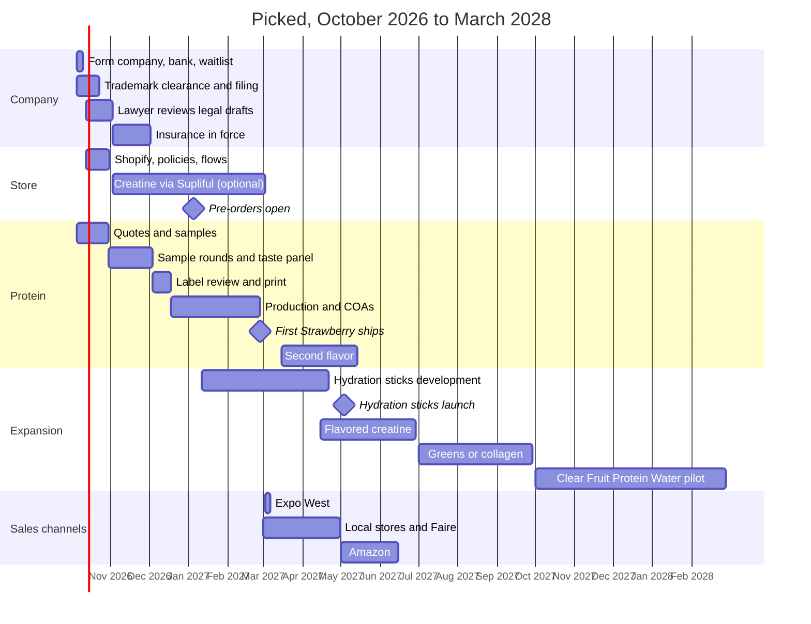

# Picked timeline: realistic dates

Starting Monday, October 5, 2026. Dates assume the owner spends real time each
week and acts on each step the week it comes up. The manufacturer is the
critical path: almost every date moves with its sample and production
schedule. December holidays slow manufacturers, lawyers, and printers, and
the plan allows for that.

## When things happen

| Milestone | Target date | What it depends on |
| --- | --- | --- |
| Company formed, EIN, bank account, waitlist live | **Oct 9, 2026** (week 1) | Owner's time |
| Quote requests out to seven manufacturers, NutraSeller and Pure Private Label first | **Oct 9, 2026** | `outreach/manufacturer-emails.md`, `MANUFACTURING.md` |
| Trademark filed (after clearance opinion) | **Oct 23, 2026** | Attorney availability |
| Shopify store set up with policies, flows, and a real test order | **Oct 30, 2026** | `OPERATIONS.md`, lawyer review of `legal/` |
| Optional: first revenue from Picked Creatine (unflavored) via Supliful, shipped outside New York and California | **Nov 6, 2026** | Store live, age rules handled |
| Samples ordered ($695 at Pure Private Label if it can make whey, or the chosen manufacturer's development fee) | **Oct 23, 2026** | Quotes back |
| Strawberry formula locked after 2 to 3 sample rounds and the taste panel | **Dec 4, 2026** | Manufacturer speed |
| Label reviewed and printed | **Dec 18, 2026** | Label consultant, printer |
| Purchase order and deposit | **Dec 18, 2026** | Cash: about $8k for a 144-unit run, about $45k for 1,000 |
| **Pre-orders open** to the waitlist with an honest ship date | **Jan 5, 2027** | Store live, lot plan |
| Expo West (walk the show, book buyer meetings ahead) | **Mar 2 to 5, 2027** | Sell sheet ready |
| **First Strawberry ships** (8 to 10 weeks after label approval, plus holidays) | **late Feb to mid Mar 2027** | Production and passing COAs |
| Local stores and Faire live | **Mar 2027** | Product in hand |
| Hydration sticks: development starts | **Jan 2027** | Protein formula locked, cash |
| Mango or Raspberry Lemon (waitlist vote winner) | **Apr to May 2027** | Strawberry 50% sold |
| **Real Fruit Hydration sticks launch** | **May 2027** | 12 to 16 weeks from development start |
| Amazon listing | **May to Jun 2027** | Pending trademark, GS1 barcodes, Amazon's third-party verification |
| Whole Foods local and emerging program application | **Jun 2027** | Sell-through data |
| Real-fruit creatine (flavored) | **Jun to Jul 2027** | Age checks in place |
| Greens or collagen with fruit | **Q3 2027** | Gates in `EXPANSION.md` |
| Ready-to-drink Clear Fruit Protein Water pilot | **Q4 2027 to Q1 2028** | Profitable powder line, retail reorders |

**Earliest real-fruit protein in a customer's hand: about 20 to 23 weeks from
today.** Anyone promising faster for a custom formula is either using a stock
formula or skipping testing. A stock product through Supliful can sell within
about 5 weeks, which is why it's in the plan as a store-starter.

## The plan as a chart

## Cash by stage (estimates)

| Stage | Lean path | Standard path |
| --- | --- | --- |
| Company, trademark, insurance, lawyer review | $3k to $6k | $5k to $10k |
| Store and software, first 6 months | about $250 | about $250 |
| Optional creatine via Supliful | $300 to $1k in fees and samples | same |
| Strawberry protein: samples and first run | about $5k to $8k (144 units at Pure Private Label) | about $30k to $45k (1,000 pouches) |
| Hydration sticks | $3k to $5k (144-unit custom run) | $10k to $15k (7,500 sticks at StickPax) |
| Second protein flavor | $3k to $5k | $20k to $25k |
| **Total through May 2027** | **about $15k to $25k** | **about $65k to $95k** |

The lean path tests demand with small runs and higher unit costs. Switch to
bigger runs once a product sells through, because the per-unit price drops.

## What could move the dates

- **Sample rounds:** each extra round adds 1 to 2 weeks. Getting real-fruit
  flavor right in a clear whey may take three.
- **Holidays:** expect manufacturers and printers to lose about two weeks
  from mid-December.
- **Trademark refusal:** if "Picked" fails clearance, packaging waits for the
  new name (Bushel is the backup).
- **Testing:** a failed heavy-metal or micro test means a new lot.
- **Cash:** the standard path needs the full first-run amount in December.
